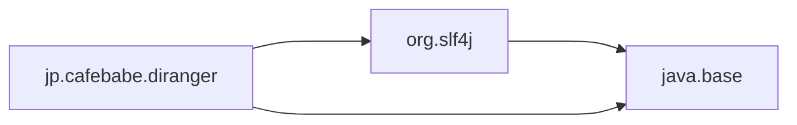

# diranger

[](https://github.com/tamada/pochi/blob/main/LICENSE)
[](https://github.com/tamada/pochi/releases/tag/v1.0.0-beta1)

## :speaking_head: Description

This product provides an API for traversing directories.
The features of this API are:

* Skip symbolic links, 
* Skip hidden files, and
* Respect `.gitignore` files.

It also supports standard Java iterators: `Iterator`, `Iterable`, `Stream`, and `List`.

## :runner: Usage

```java
var ranger = new RangerBuilder().build();
ranger.stream(Path.of("target/directory"), new Config())
    .forEach(System.out::println);
```

In this example, the stream skips symbolic links and hidden files and respects `.gitignore` files.
With other parameters, use `Config.Builder` for building `Config` object.

### :anchor: Download

#### Gradle

Copy and paste the following snippet into your `build.gradle`. 

```groovy
repository {
  mavenCentral()
  maven {
    url "https://tamada.github.io/maven"
  }
}

dependencies {
  // ...
  implementation group: 'jp.cafebabe', name: 'diranger', version: '1.0.0-beta-1'
  // ...
}
```

#### Maven

Copy and paste the following snippet into your `pom.xml`.

```xml
  <repositories>
    <repository>
      <id>tamada.maven.github</id>
      <name>Maven repository of Tamada on GitHub</name>
      <url>https://tamada.github.io/maven/</url>
    </repository>
  </repositories>

  <dependencies>
    <dependency>
      <groupId>jp.cafebabe</groupId>
      <artifactId>diranger</artifactId>
      <version>1.0.0-beta-2</version>
    </dependency>
  </dependencies>
```

#### Module



### :package: Dependencies

* [jgit 6.3.0.202209071007-r](https://mvnrepository.com/artifact/org.eclipse.jgit/org.eclipse.jgit/6.3.0.202209071007-r)
* [slf4j-api 2.0.03](https://mvnrepository.com/artifact/org.slf4j/slf4j-api/2.0.3)

This product contains `org.eclipse.jgit.ignore.IgnoreNode` class and its dependent classes (a part of `jgit`).

## :smile: About

### :scroll: License

MIT License

- Permissions
  - 👍 Commercial use
  - 👍 Modification
  - 👍 Distribution
  - 👍 Private use
- Limitations
  - ❌ Liability
  - ❌ Warranty

### :tophat: Project Logo

This is the logo of `diranger`.


This image is from [iconscout.com](https://iconscout.com/icon/forest-ranger-4529387).

### :name_badge: Project Name

The project name `diranger` shows the directory ranger from its feature.

### :man_office_worker: Developers :woman_office_worker:

* [Haruaki TAMADA](https://tamada.github.io/) ([@tamada](https://github.com/tamada))
